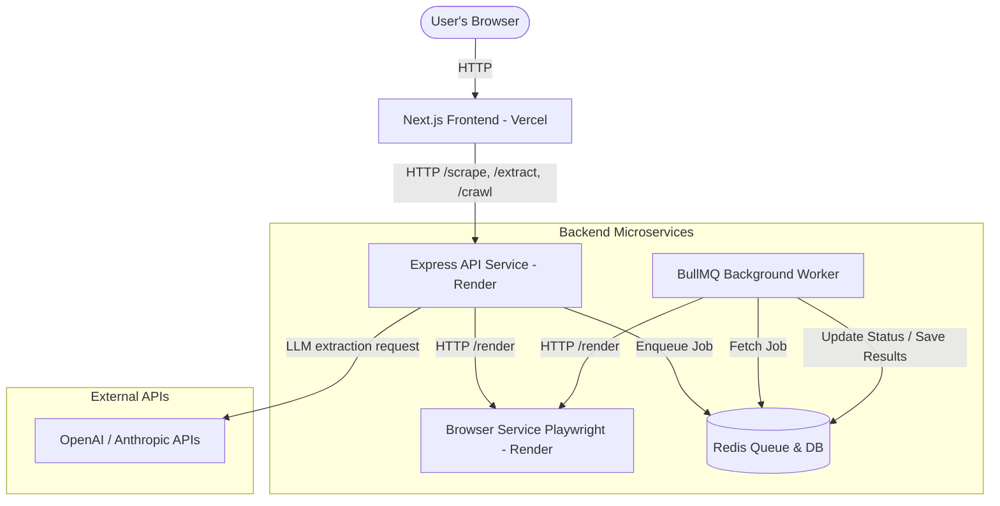

# WaterCrab 🦀

WaterCrab is a scalable, distributed web scraping and structured extraction service. It renders JavaScript-heavy websites using a headless browser microservice, cleans boilerplate/ads from the document tree, converts cleaned elements to Markdown, and uses LLMs (OpenAI & Anthropic) in a Bring Your Own Key (BYOK) pipeline to extract custom structured data. It also supports asynchronous multi-page crawling powered by Redis and BullMQ.

---

## 🏗️ System Architecture



---

## 📁 Project Structure

```
WaterCrab/
├── backend/                  # Express API Server & BullMQ Worker
│   ├── src/
│   │   ├── index.js          # REST API endpoints (/scrape, /extract, /crawl)
│   │   ├── worker.js         # BullMQ queue runner entrypoint
│   │   ├── worker-processor.js # Multi-page recursive crawl runner
│   │   ├── queue.js          # BullMQ queue manager (with in-memory fallback)
│   │   └── db.js             # Data Layer (Redis / Local JSON-file fallback)
│   ├── Dockerfile.api        # Docker container definition for API
│   ├── Dockerfile.worker     # Docker container definition for Worker
│   └── package.json
├── browser-service/          # Standalone Headless Rendering Service
│   ├── src/
│   │   └── index.js          # Express app wrapping Playwright Chromium
│   ├── Dockerfile            # Docker container definition for Browser Service
│   └── package.json
├── frontend/                 # Interactive Next.js Dashboard UI
│   ├── src/
│   │   └── app/
│   │       ├── page.tsx      # Main application page (Form & Results view)
│   │       └── layout.tsx    # Layout and metadata configurations
│   └── package.json
├── docker-compose.yml        # Orchestration script for local multi-service running
└── render.yaml               # Infrastructure-as-code Blueprint deployment for Render
```

---

## 🚀 Quickstart: Local Development

### Option A: Run with Docker (Recommended)
This is the easiest way to launch the entire environment (API, worker, browser rendering service, and Redis instance).

1. Make sure you have Docker installed and running.
2. From the root directory, run:
   ```bash
   docker-compose up --build
   ```
3. Open your browser to `http://localhost:3000` to access the dashboard.

### Option B: Run without Docker (Node.js)
If you don't have Redis or Docker installed, the services will automatically fall back to **in-memory & local file systems** (`jobs.json`) to manage tasks, allowing you to test everything instantly.

1. **Start the Browser Service:**
   ```bash
   cd browser-service
   npm install
   npx playwright install chromium
   npm run start
   ```
   *Runs on `http://localhost:3002`.*

2. **Start the Backend API:**
   ```bash
   cd ../backend
   npm install
   npm run start
   ```
   *Runs on `http://localhost:3001`.*

3. **Start the Frontend Dashboard:**
   ```bash
   cd ../frontend
   npm install
   npm run dev
   ```
   *Runs on `http://localhost:3000`.*

---

## 🚀 Production Deployment

### 1. Backend (Render)
Deploying the backend microservices to Render is fully automated using our **Render Blueprint** (`render.yaml`).

1. Push this repository to your GitHub account.
2. In the Render Dashboard, click **New** -> **Blueprint**.
3. Select your repository.
4. Render will parse `render.yaml` and provision:
   - A Redis instance (`watercrab-redis`)
   - The Playwright rendering microservice (`watercrab-browser`)
   - The Express API (`watercrab-api`)
   - The background task runner (`watercrab-worker`)
5. All environment variables and secure internal networking will be configured automatically.

### 2. Frontend (Vercel)
1. In the Vercel Dashboard, click **Add New** -> **Project**.
2. Import this repository.
3. Configure the Root Directory to `frontend`.
4. Add the following Environment Variable:
   - `NEXT_PUBLIC_API_URL`: The URL of your deployed `watercrab-api` on Render (e.g. `https://watercrab-api.onrender.com`).
5. Click **Deploy**.

---

## 🛡️ Security Policy (BYOK)
WaterCrab prioritizes user privacy. When performing LLM-guided structured extraction, the user supplies their own API Key.
- Keys are sent directly over secure HTTPS transport to the `/extract` endpoint.
- Keys are **never** persisted to databases.
- Keys are automatically redacted and masked from all backend application logs and error response payloads using dedicated sanitizer utilities.
